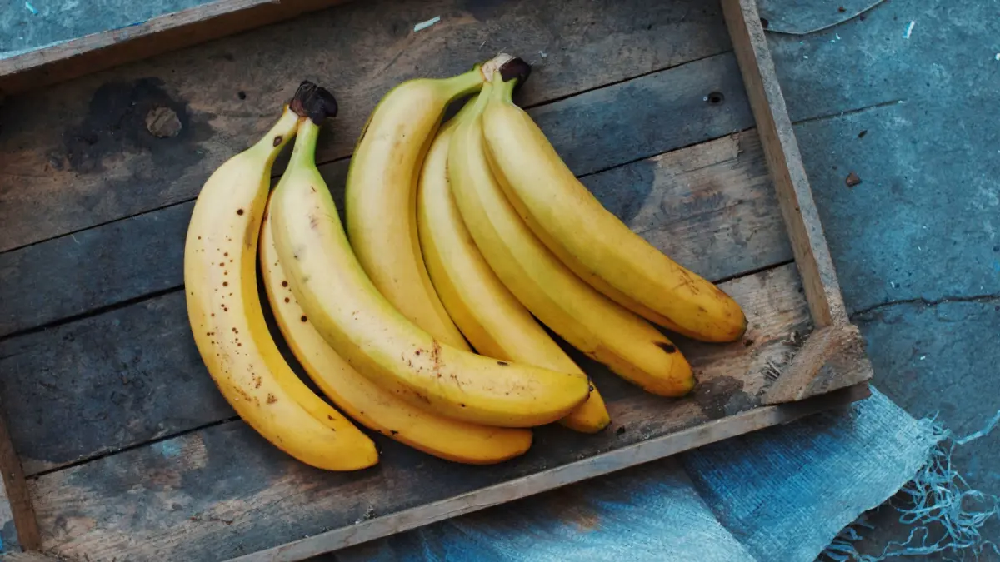

## Task 1

## Read these Definitions and the examples of each - Can you see how the term applies?:

* Misinformation: False info shared without intent to deceive [Example](https://nymag.com/intelligencer/2017/01/sean-spicer-retweets-the-onion-calling-job-misinformation.html)

* Disinformation: Deliberately deceptive info [Example](https://globalnews.ca/news/10289988/lululemon-greenwashing-claims-environmental-groups/)

* Malinformation: True info used to cause harm [Examples](https://en.wikipedia.org/wiki/Malinformation)

### Common motives for mis/dis/malinformation: 
* [clicks](https://engineering.nyu.edu/news/misinformation-facebook-got-six-times-more-clicks-factual-news-during-2020-election-study-says), 
* [money](https://www.bbc.co.uk/news/articles/cx2dpj485nno), 
* [politics](https://news.mit.edu/2024/misinformation-is-all-around-how-can-we-combat-it-1022), 
* [trolling](https://www.youtube.com/watch?v=dQw4w9WgXcQ)

### We’re all vulnerable: 
Have a look at these common issues:

* [confirmation bias](https://thedecisionlab.com/biases/confirmation-bias), 

* [echo chambers](https://www.theguardian.com/science/blog/2017/dec/04/echo-chambers-are-dangerous-we-must-try-to-break-free-of-our-online-bubbles)

it's worth noting that they're just the most applicable of the [huge list of cognitive biases we humans are subject to](https://en.wikipedia.org/wiki/List_of_cognitive_biases)

## Task 2:

Research the following - Which are true, How do you know?

### 1 - “BREAKING: Scientists say bananas are doomed — a deadly fungus is wiping them out fast! Eat ‘em while you can! 🍌 #BananaCrisis #FoodPanic”

### 2 - Missile strike in Tel Aviv:
[SilencedSirs◼️ \(@SilentlySirs\) on X](https://x.com/SilentlySirs/status/1839445117780062529)

### 3 - Katy Perry in space:
[Technosmith \(@itechnosmith\) on X](https://x.com/itechnosmith/status/1912469592280048016?ref_src=twsrc%5Etfw%7Ctwcamp%5Etweetembed%7Ctwterm%5E1912469592280048016%7Ctwgr%5E14c18604b7b75a0b0d3489d5b1bd20c34dc5b30e%7Ctwcon%5Es1_&ref_url=https%3A%2F%2Fwww.euronews.com%2Fculture%2F2025%2F04%2F18%2Fdebunking-the-conspiracy-theorists-who-claim-katy-perrys-space-trip-was-a-hoax)

### 4 - "Häagen-Dazs" has no meaning in any language, it was meant to sound "European". It was started by Reuben Mattus, a Polish immigrant to New York who sold fruit ice and ice cream from a horse-drawn cart.

---

## Task 3:

Now you have had some practice - [try the snopes quiz](https://www.snopes.com/game/)

---

## Politics: 
I've put this down here because of the sensitive nature of it 

#### Toolbox: How to Verify Information
| **Tool** | **What it Does** | **Link** |
|:-:|:-:|:-:|
| **Google Reverse Image Search** | Check if an image is real or used out of context | ~[images.google.com](https://images.google.com/)~ |
| **TinEye** | Track where an image first appeared | ~[tineye.com](https://tineye.com/)~ |
| **Snopes** | Fact-check viral claims | ~[snopes.com](https://www.snopes.com/)~ |
| **Full Fact (UK)** | Debunk UK political claims | ~[fullfact.org](https://fullfact.org/)~ |
| **Media Bias Chart** | Visual guide to bias and reliability of news outlets | ~[adfontesmedia.com](https://adfontesmedia.com/)~ |

#### Checklist for verification:
1. Who published/shared it?
2. What evidence is given?
3. Any reliable sources cited?
4. Can you find this story elsewhere?
5. Any strong bias, emotional language, or clickbait?
6. Do images look edited or out of place?

